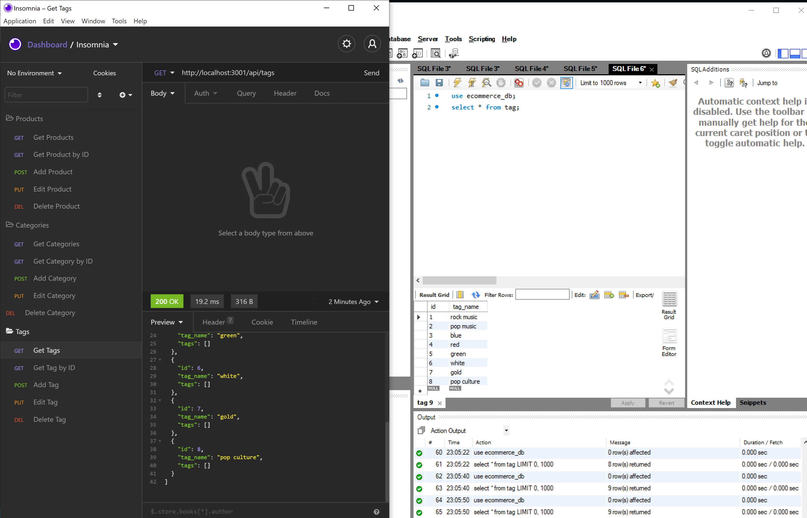

# E-Commerce-Platform-Back-End
This application allows a user to GET, POST, PUT, and DELETE from an e-commerce backend using insomnia.
Here is a video walkthrough: [Here](https://drive.google.com/file/d/1MLscpTmNCMHewSLBOaYOi2IlJDfOYvpT/view)
Here is what the application looks like: 